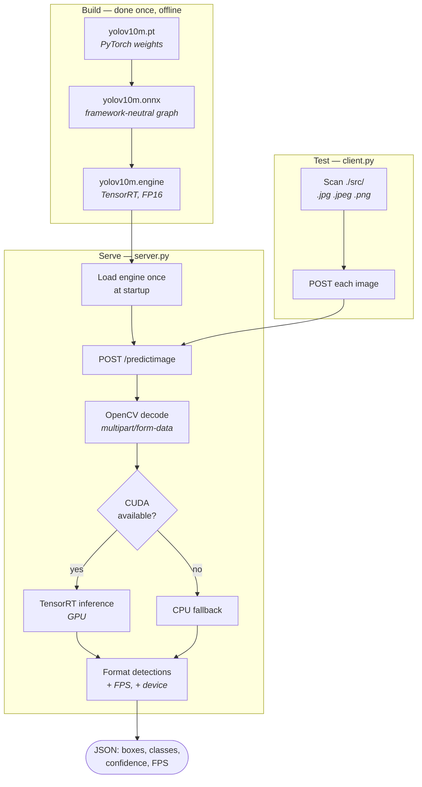

# 🎯 YOLO TensorRT Object Detection API

A Flask REST API serving **YOLOv10m accelerated with TensorRT** for offline GPU inference,
plus a client script for batch testing.

> **The point of this repo:** a PyTorch `.pt` checkpoint is the *training* artifact, not the
> *serving* artifact. Getting from one to the other — export, precision reduction, and
> confirming you did not quietly trade away accuracy for speed — is the part that actually
> decides whether a detection model is deployable. This is that path, end to end.

**Measured on this setup: 30–40 FPS at 96–97% of the baseline detection quality, FP16, single GPU.**

> ⚠️ **Disclaimer** — Demonstration project. Benchmarks are from one machine and one model
> size; treat them as a reference point, not a published result.

---

## 🏗️ How it works



---

## 🔍 Why TensorRT, and what it costs

| | PyTorch `.pt` | TensorRT `.engine` (FP16) |
|---|---|---|
| Throughput | baseline | **30–40 FPS** on this setup |
| Detection quality | baseline | **96–97%** of baseline |
| Portability | runs anywhere Torch runs | **locked to this GPU + TensorRT version** |
| Startup | model load | engine load, faster |
| Build time | none | one offline export pass |

The tradeoff worth stating out loud: **the engine file is not portable.**
TensorRT builds a plan against a specific GPU architecture and library version. Ship the
`.onnx` and rebuild on the target machine — an `.engine` copied between machines will either
refuse to load or silently underperform. This is the single most common way people get
burned by TensorRT.

FP16 (`half=True`) is where the speed comes from. The 3–4% quality cost is acceptable for
most detection workloads and unacceptable for some; measuring it rather than assuming it is
the whole point of reporting both numbers together.

---

## 📁 Module map

| File | Responsibility |
|------|----------------|
| `server.py` | Flask app — loads the TensorRT engine at startup, serves `POST /predictimage`, auto-selects CUDA with CPU fallback |
| `client.py` | Batch test client — walks `./src/`, posts each image, prints formatted JSON |
| `yolov10m.pt` | Original PyTorch weights (export source) |
| `yolov10m.onnx` | Intermediate ONNX graph — **rebuild your engine from this** |
| `yolov10m.engine` | Prebuilt TensorRT engine (this machine's GPU/TensorRT version only) |

---

## ⚡ Quick Start

### Prerequisites
- Python **3.9+**
- NVIDIA GPU with CUDA (CPU fallback works but defeats the purpose)
- TensorRT matching your CUDA version

```bash
pip install flask torch torchvision torchaudio ultralytics opencv-python requests
```

### 1. Clone

```bash
git clone https://github.com/JiangAllen/yolo-tensorrt-api.git
cd yolo-tensorrt-api
```

### 2. Build the engine **on your own machine**

The included `.engine` was built for a different GPU. Rebuild it:

```python
from ultralytics import YOLO
model = YOLO("yolov10m.pt")
model.export(format="engine", half=True)
```

### 3. Run

```bash
python server.py          # http://0.0.0.0:8000
```

### 4. Test

Put images in `./src/`, then:

```bash
python client.py
```

---

## ⚙️ API

### `POST /predictimage`

Object detection on a single image. Supports the 80 standard COCO classes.

**Request** — `Content-Type: multipart/form-data`, field `file`

**Response**

```json
{
  "detections": [
    { "classid": 0, "classname": "person", "confidence": 0.97, "box": [15, 20, 240, 400] }
  ],
  "fps": 35.2,
  "device": "cuda"
}
```

`box` is `[x1, y1, x2, y2]` in pixels. `fps` is measured per request, so it includes decode
overhead — it is a serving number, not a raw inference number.

**Error** — `{"error": "No file"}`

---

## ⚠️ Known limitations

- **Single image per request.** No batching, so throughput under concurrent load is well
  below the single-image FPS figure.
- **Flask development server.** Fine for testing; put gunicorn or similar in front of it
  for anything else.
- **The committed `.engine` is machine-specific** and will not load on most other GPUs.
  It is included for reference only — see step 2 above.
- **No authentication, no rate limiting, no request size cap.** Do not expose this directly.
- Benchmarks are from a single machine with one model size; no sweep across
  input resolutions or batch sizes.

---

## 🛠️ Troubleshooting

| Issue | Cause | Fix |
|-------|-------|-----|
| `RuntimeError: CUDA not available` | Driver or CUDA not installed | Check `torch.cuda.is_available()` |
| Engine fails to load | Built for a different GPU or TensorRT version | Re-export from `.pt` or `.onnx` on this machine |
| Slow FPS | Silently fell back to CPU, or oversized inputs | Check `"device"` in the response; resize inputs |
| `Invalid image format` | Corrupted or unsupported file | Verify the file is valid `.jpg` / `.png` |
| `No file` error | Missing `file` field | Use `multipart/form-data` |

---

## 📚 Related work

- **[rag-chatbot](https://github.com/JiangAllen/rag-chatbot)** — RAG and GraphRAG retrieval
  architectures; includes a YOLO + CLIP subject-aware image cropping utility.
- **[patent-pipeline-demo](https://github.com/JiangAllen/patent-pipeline-demo)** — LLM
  quantization and local deployment under a 12GB VRAM constraint, with a three-layer
  evaluation system. Same optimization-versus-quality question, different modality.
